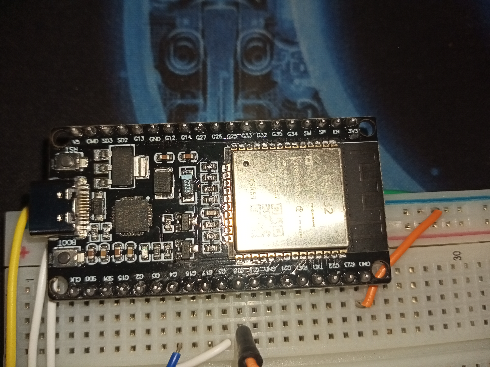
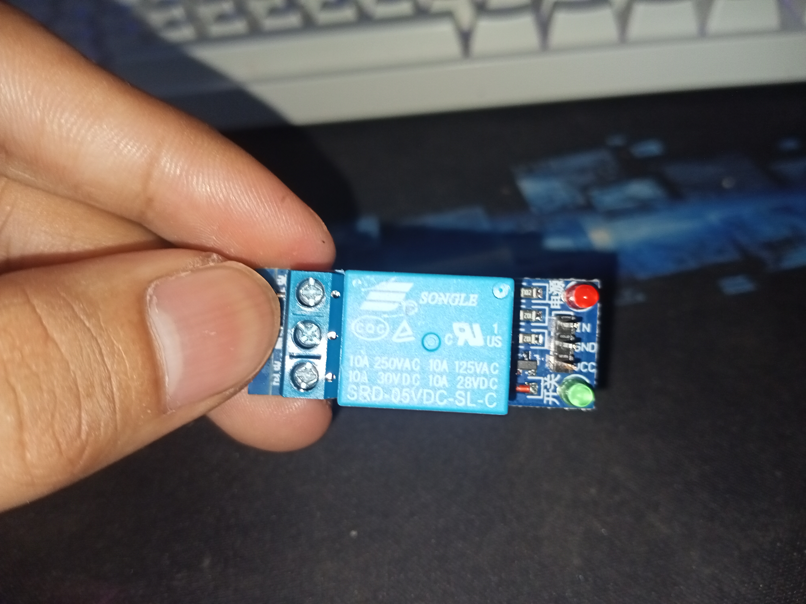
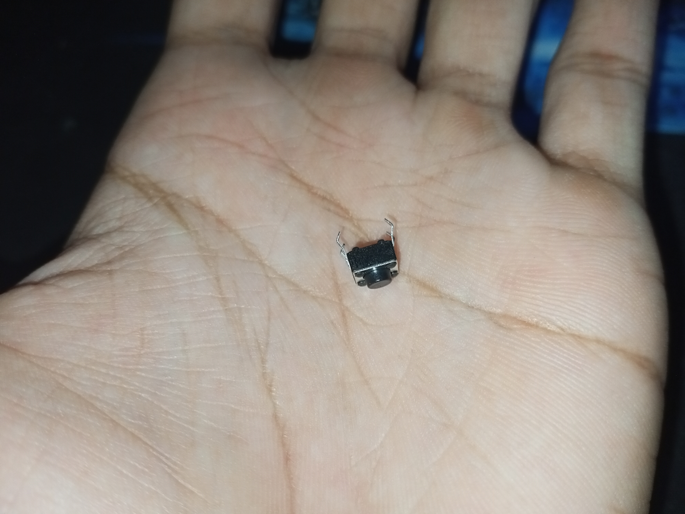
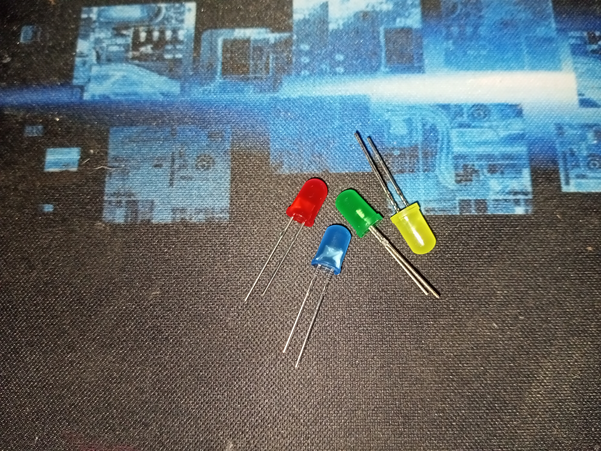
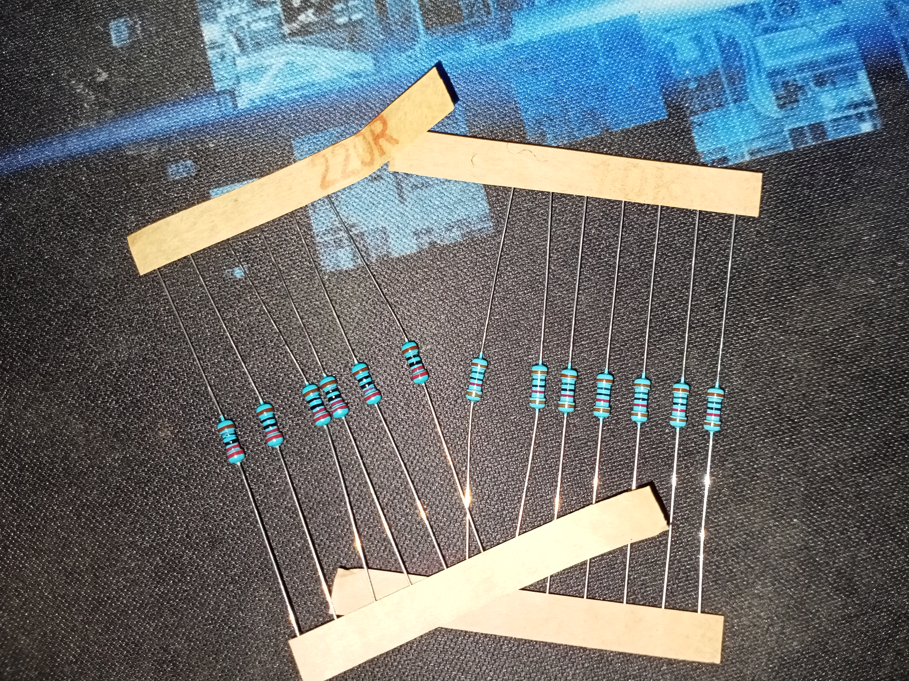
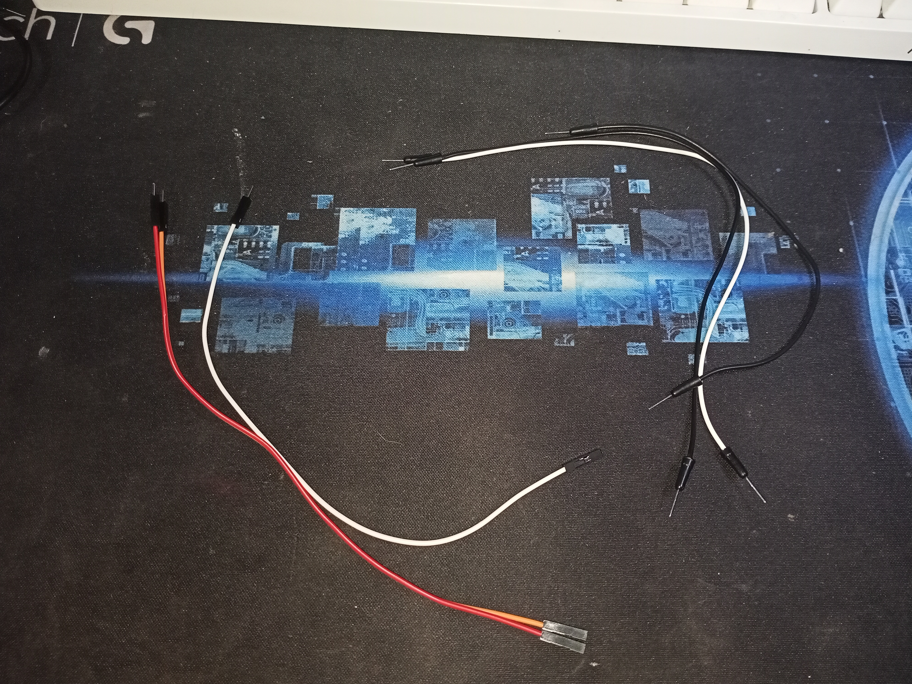

## ESP32 Smart PC Power Controller

A **full guide** for Controlling your PC's power button remotely using an ESP32, a relay module, and a web interface — ideal for headless setups, remote access, or smart home integration.

---

### Why I Made This

I created this project because I wanted a way to **turn my PC on and off using the ESP32**, both **locally** and **over the internet**. While local control was straightforward, **remote control via the internet** presented challenges — especially due to **CGNAT (Carrier-Grade NAT)** and the lack of a public IP.

There’s an existing method called **Wake-on-LAN (WoL)** that lets you wake a PC on the local network. If you only need **local access**, I recommend using that instead — it's much simpler to set up.  
🔍 [GitHub Search: Wake-on-LAN Projects](https://github.com/search?q=wake+on+lan)

However, **WoL typically doesn't work over the internet without complicated setup**, so for users who need **true remote access**, I began developing this project as an alternative solution.

My goal was to build a system that could simulate pressing the PC power button using a relay, with commands sent through a web interface — even from anywhere in the world.

> 🔧 **Note:** For full remote access over the internet, additional steps are required such as:
> - Using an always-on device ( A **Raspberry Pi** or another device that stays online 24/7 to act as a secure gateway.)
> - Setting up tunneling tools like **Tailscale**, **ZeroTier**, or **Ngrok**

This repository focuses on developing the **core system** — the ESP32-based power control logic. If you're interested in the **internet-access setup**, I got a step-by-step tutorial separately to help you get started with secure remote access to your ESP32 controller below.

---

## Features

- 🖱️ Physical button or web-triggered PC power control
- 🌐 Simple web interface served from ESP32 (LittleFS)
- 🔁 1-second relay pulse simulates pressing your PC's power button
- 📶 Wi-Fi based — no need for external servers
- 💡 Status LED to indicate system is running

---

## Hardware Requirements

| Component                     | Quantity | Description                            |
|------------------------------|----------|----------------------------------------|
| ESP32 Dev Board              | 1        | Microcontroller for control & Wi-Fi    |
| 5V Relay Module              | 1        | Used to simulate PC power button       |
| Push Button (Normally Open)  | 1        | Local manual trigger                   |
| LED + 220Ω Resistor          | 1        | Status indication                      |
| 10kΩ Resistor                | 1        | Pull-down resistor for push button     |
| Jumper Wires (M-M, M-F)      | As needed| Connections between ESP32 and components |
| Breadboard                   | 1        | Prototyping board                      |
| Power Adapter (5V USB)       | 1        | Powering the ESP32 board               |

> ⚠️ **Note:** These are the minimum requirements to run the system.  
> You are **free to customize or expand** the hardware setup as long as you understand what you're doing.

### Component References

| Image | Description |
|-------|-------------|
|  | **ESP32 Dev Board** — The main controller |
|  | **Relay Module** — triggers the PC Switch |
|  | **Push Button** — used for manual test triggering |
|  | **LED** — shows when relay is active |
|  | **220Ω Resistor** — limits LED current && **10kΩ Resistor** — for pulling down push button |
|  | **Jumper Wires (M-M & M-F)** — essential for ESP32 components |

---

## Wiring Diagram (Simplified)

| ESP32 Pin | Connected To              |
|-----------|---------------------------|
| GPIO 18   | Relay IN                  |
| GPIO 5    | Status LED (through 220Ω) |
| GPIO 12   | Push Button (to GND)      |
| GND       | Relay GND + Button GND    |
| 5V        | Relay VCC (if required)   |

We will use a Relay **NO (Normally Open)** and **COM** to connect to your PC's power switch header.

---

## Web Interface

- Hosted on the ESP32 using LittleFS
- Pages:
  - `/pc.html`: control panel
  - `/style.css`: basic styling
- Trigger endpoint: `POST /trigger`

---

## Project Structure (In Wokwi)

This project was initially developed and simulated using [Wokwi](https://wokwi.com/), a virtual simulator for Arduino and ESP32 development.

If you want to view and simulate the project virtually on Wokwi, you can check it out here along with the initial code:  
🔗 [Wokwi Simulation – ESP32 Remote Power Control](https://wokwi.com/projects/434588948519734273)

### Why Simulate First?

I built and tested the project virtually before applying it to real hardware to ensure that:

- The code logic works correctly
- The relay triggers as expected
- The button and LED behavior is functional
- No physical components get damaged during development

Simulating the project first helped me **identify and fix potential issues early**, saving time and avoiding unnecessary troubleshooting on real hardware.
This project was initially developed and simulated in Wokwi, a virtual electronics simulator for Arduino and ESP32 projects.

### Screenshot of the Diagram (Initial Testing)

Initial testing was done virtually using Wokwi to verify the logic and functionality of the ESP32-based remote power control project before applying it to the actual hardware. Below are the screenshots taken during different stages of the simulation:

---

*Figure 1: Initial diagram setup in the virtual environment, showing the ESP32 ready to connect to a Wi-Fi network.*

---

*Figure 2: Successful Wi-Fi connection with the ESP32 displaying its assigned IP address, confirming network connectivity.*

---

*Figure 3: Simulation of the power control feature — when the push button is pressed, the relay is activated for one second, mimicking a real PC power switch trigger.*

---

### Explanation of the Diagram (Initial Testing)

The image below illustrates the **virtual wiring diagram** used for initial testing of the ESP32 Smart PC Power Controller in the Wokwi simulator. Each labeled part helps demonstrate how the ESP32, relay, LEDs, and buttons work together to simulate a PC power switch.

---

*Figure 4: Legend and explanation of the components and symbols used in the virtual diagrams above, providing clarity for understanding the simulation setup.*

**Legend & Functionality Overview:**

- 🟢 **Push Button (FOR TESTING)** – Used in the simulation to manually trigger the system, mimicking a software/web command.
- 🔴 **Actual PC Switch (AS LED)** – Represents your PC's physical power switch. Triggered by the relay to simulate a real press.
- 🟡 **Status LED** – Indicates system activity or response (e.g., lights up when triggered).
- 🟠 **Resistors (220Ω)** – Current limiting resistors used for protecting LEDs.
- 🧠 **ESP32 Dev Board** – The microcontroller at the heart of the system, running the firmware and handling Wi-Fi connectivity.
- 🔌 **5V System / GND System** – Power rails for the breadboard circuits, derived from the ESP32’s onboard supply.
- 🔵 **Relay Module** – Acts as the actual switch that physically “presses” the PC power button by completing its circuit.
- 🟩 **GPIO Pins:**
  - **GPIO 4** – Connected to relay signal input.
  - **GPIO 5** – Controls the status LED.
  - **GPIO 12** – Reads the state of the push button.

**Behavior in Simulation:**
- When the push button is pressed, GPIO 12 reads HIGH.
- This triggers the relay via GPIO 4, simulating a PC power press for one second.
- Simultaneously, GPIO 5 turns on the status LED to indicate that the action was taken.
- Console logs (seen at the bottom of the simulation) show system startup and Wi-Fi connection status.

> This setup was tested virtually in Wokwi to validate the logic before applying it to physical hardware.

---

## Actual Testing (Hardware Deployment)

Since our initial testing in [Wokwi](https://wokwi.com/projects/434588948519734273) was successful, we can now proceed with **actual hardware testing** using a real ESP32 and physical components.

Before we begin, please make sure you’ve completed the following requirements to ensure a smooth deployment:

---

### Pre-Requisites Checklist

Before You Begin

Please make sure you have the following prepared before flashing the project to your ESP32:

1. **Hardware Components**  
   Ensure you have everything listed in the [Hardware Requirements](#hardware-requirements), including:
   - ESP32 Dev Board
   - 5V Relay Module
   - Push Button (optional for testing)
   - LED + 220Ω Resistor
   - Breadboard, Jumper Wires, and a suitable USB Cable (Type-C or Micro-USB)

2. **Software & Tools**  
   To run this project on actual hardware, you'll need:
   - [**Arduino IDE**](https://www.arduino.cc/en/software)
   - ESP32 Board Package installed in the IDE
   - Required USB drivers for your ESP32 (CH340, CP2102, etc.)
   - [**LittleFS Uploader Tool**](https://github.com/earlephilhower/arduino-littlefs-upload) to flash the web interface to ESP32 storage

   > ⚠️ Don’t worry about setup steps just yet — we’ll cover all the installation instructions in the **Installation Process** section.

3. **Cables and Power**  
   Ensure you're using a **data-capable USB cable** to connect the ESP32.  
   Power the relay with 5V, and avoid overloading the ESP32 by powering high-current devices directly.

---

## Installation Process 

> ⚠️ **Note:** This installation guide is written for **Windows users**.  
> If you're using **macOS** or **Linux**, the general steps are the same, but:
> - You’ll need to install USB drivers manually (check your ESP32 chip model).
> - File paths and menu locations may vary slightly.
> - Arduino IDE and LittleFS still work across all platforms.
>
> 📎 Refer to your OS-specific instructions or community tutorials if needed.

---

To begin working with your ESP32 hardware, follow these installation steps:

### 1. Install Arduino IDE
Download and install the latest version of the Arduino IDE from:  
🔗 https://www.arduino.cc/en/software

### 2. Install ESP32 Board Support
- Open Arduino IDE.
- Go to **File > Preferences**.
- In the **"Additional Board Manager URLs"**, paste this:("https://raw.githubusercontent.com/espressif/arduino-esp32/gh-pages/package_esp32_index.json")
- Click **OK**, then go to **Tools > Board > Boards Manager**.
- Search for **ESP32** and click **Install** on the package by **Espressif Systems**.

### 3. Install USB Drivers (CH340 / CP2102)
Depending on your ESP32 board:
- [CH340 Driver (Windows)](https://sparks.gogo.co.nz/ch340.html)
- [CP2102 Driver](https://www.silabs.com/developers/usb-to-uart-bridge-vcp-drivers)

Install the correct driver so your computer can detect the ESP32 over USB.

### 4. Install LittleFS Uploader
We use LittleFS to upload web interface files to the ESP32.

- Visit the repo: [arduino-littlefs-upload](https://github.com/earlephilhower/arduino-littlefs-upload)
- Follow the instructions to install the `LittleFS Uploader` tool.
- After installing, restart Arduino IDE.
- You should now see **"ESP32 Sketch Data Upload"** under the **Tools** menu.

### 5. Set the Correct Board and Port
- Go to **Tools > Board**, and select your ESP32 model (e.g., **ESP32 Dev Module**).
- Go to **Tools > Port**, and select the COM port assigned to your ESP32.
- Also set:
- **Flash Size**: 4MB (or match your board)
- **Partition Scheme**: "Default 4MB with spiffs (1.2MB APP/1.5MB SPIFFS)" (or similar)

---

## Uploading the Code

You can view or download the main sketch file here:  
🔗 [sketch_esp32.ino](https://github.com/fnskye/ESP32PCRemote/blob/main/sketch_esp32.ino)

1. Open the `.ino` file in Arduino IDE.
2. Connect your ESP32 to your PC using a **data-capable USB cable**.
3. Confirm:
   - Correct board is selected under **Tools > Board**
   - Correct port is selected under **Tools > Port**
4. Click the **Upload** button (checkmark icon).
5. Wait for the "Done Uploading" message.

> If you see "Connecting....", hold the **BOOT** button on the ESP32 until upload starts (for some boards).

---

## Uploading Web Files (LittleFS)

Your ESP32 will serve the web interface from internal storage using **LittleFS**.

1. Create a folder named `/data` in the same directory as your `.ino` file.
2. Place your web files (HTML, JS, CSS) inside `/data`.
3. Go to **Tools > ESP32 Sketch Data Upload**.
4. Wait for upload to complete. It should say something like: [SPIFFS] upload : 100% complete

> If you don’t see this option, double-check your LittleFS tool installation.

---

## Accessing the Web Interface

1. Open **Serial Monitor** from Arduino IDE (**Tools > Serial Monitor**) and set baud rate to **115200**.
2. After boot, the ESP32 will attempt to connect to Wi-Fi and print the **local IP address**, like:

> Connected to WiFi!
> IP Address: (e.g., `http://192.168.1.42`)

3. Open a browser and go to `http://<ESP32-IP>` (e.g., `http://192.168.1.42`).
4. You should see the **Smart PC Power Controller** web interface.

---

## Why We Are Uploading Code and Web Files?

### 1. Uploading the `.ino` Sketch 
The `.ino` file contains the main **logic and control code** for the ESP32. 

This includes:

- Connecting to your Wi-Fi network
- Handling HTTP requests from the browser
- Activating the relay when triggered
- Controlling the status LED
- Reading input from the push button

> Without uploading this code, the ESP32 will be blank and won't know what to do.

### 2. Uploading Web Files (Interface via LittleFS)
The web interface (HTML, CSS, JavaScript) is not stored inside the `.ino` sketch — it must be uploaded separately using **LittleFS**. 

These files:

- Serve the user interface you see in your browser
- Provide a button to trigger the PC power switch
- Run inside the ESP32's internal file system (not an SD card)

> These allow your ESP32 to become a fully working **smart PC power controller** that you can access from any device on your local network.

---

## Differences Between Simulation and Actual Code

While the Wokwi simulation helps prototype the logic, actual hardware development often involves tweaking pins and adding physical indicators for real-world interaction and stability. Here we can see the key changes in the final version.

---

### 1. **GPIO Pin Changes**
| Function          | Wokwi (Simulation) | Actual ESP32 Sketch | Notes |
|-------------------|--------------------|----------------------|-------|
| Relay Control     | GPIO 4             | GPIO 18              | Changed for better GPIO stability and layout compatibility on real board |
| Status LED        | GPIO 5 (same)             | GPIO 5 (same)            | Same - used for system status indicator (always ON) |
| Push Button       | GPIO 12 (same)           | GPIO 12 (same)             | Same — no change at all |
| Relay LED         | Not implemented    | GPIO 4               | Added for visual feedback; in Wokwi, the relay directly simulated the PC |

---

### 2. **New Features in Actual Code**

| Feature                        | Description |
|--------------------------------|-------------|
| **Relay LED Indicator**        | GPIO 4 is used to show when the relay is active — helps confirm physical triggering visually |
| **Debounce Logic**             | Prevents false triggering from physical button presses due to mechanical noise |
| **Relay Pulse Timing**         | Limits activation to 1 second to safely simulate a PC power press |

---

- Some **GPIO pins behave differently** on physical ESP32 boards than in simulation (e.g., boot behavior, signal stability).
- We added a **Relay LED** because on real hardware sometimes you can't "see" the relay toggle (depends on the model of the relay) — this gives real-time confirmation.
- Software **debounce and timing logic** are necessary to handle real button mechanics and safe PC triggering.
> Don't worry, as the overall project functionality is the same.  
> These improvements just make it **safer, clearer, and more stable** in a real-world setup.

---

## Layouts and Setups of the Actual Hardware (Breadboard and Wiring)

> **Why we do this:**  
> This section shows you how to physically assemble your ESP32 system — including how each component connects on the breadboard, what pins are used, and how to avoid common wiring mistakes.

---

### General Setup Overview

The project involves connecting several components to the ESP32:

- A **relay module** for triggering the PC power
- A **push button** for manual testing
- A **status LED** for system power indicator
- A **relay LED** for visual confirmation that the PC signal was sent
- Required **resistors** for button/LED protection
- A **breadboard** and **jumper wires** for prototyping

---

### Breadboard Layout Diagram

_(Replace this with your final wiring diagram if updated)_

---

### Pin-to-Pin Wiring Table

| ESP32 Pin | Connects To           | Description                         |
|-----------|------------------------|-------------------------------------|
| GPIO 18   | Relay IN               | Relay control (Active LOW)          |
| GPIO 5    | Status LED (+220Ω)     | Indicates system power              |
| GPIO 4    | Relay LED (+220Ω)      | Lights up when relay is triggered   |
| GPIO 12   | Push Button (to GND)   | Manual trigger                      |
| GND       | Relay GND, Button GND, LED GND | Common ground for all components |
| 3.3V/5V   | Relay VCC, LED VCC     | Depending on component requirement  |

> 💡 Use **pull-down resistor (10kΩ)** for the push button if needed for stability  
> 🧪 Add a **diode** across the relay coil (if mechanical) to avoid back EMF (optional but recommended)

---

